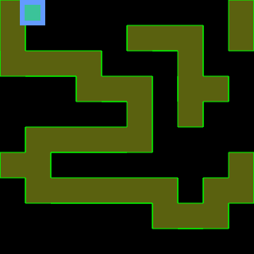

# test-phaser-collision

> :ledger: Proper way to support collision in [Phaser.js](http://phaser.io/) 

## Demo

Try https://piecioshka.github.io//test-phaser-collision/

## Controls 

Use keyboard arrows (left, right, up, down).

## License

[The MIT License](http://piecioshka.mit-license.org) @ 2016
